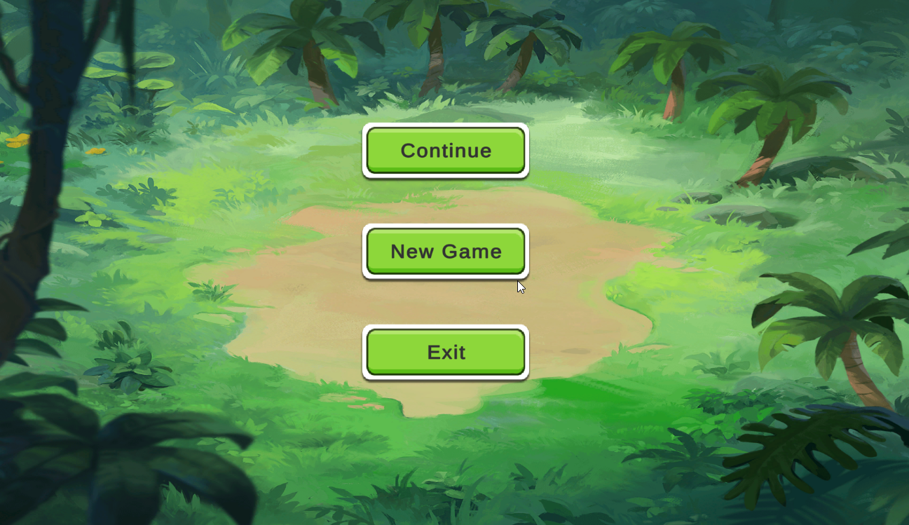
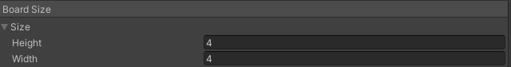

# Card-Game

## How To Start

The project includes two scenes MainMenu and GameScene. They are located in the folder `Assets/Scenes/MainMenu.unity` And from this scene, the gameplay should be launched. 

<p align="center">
  
</p>

### Continue

This mode loads the previous game and the saved score. If a player left during the game. The save was done using `PlayerPref`.
The elements and components we want to save implement the `ISave` interface. Which allows you to select the value to save.

```csharp
namespace HCC.Interfaces
{
    public interface ISave
    {
        #region Methods

        public int GetSaveValue();

        #endregion
    }
}
```
Component implementing `ISave` are persisted in the `SaveData` struct, which implements the `SaveComponent` object so that you can easily select components to save.

### New Game
The new game initializes the default gameplay according to the settings found in `GamePlaySettings` Among other things, in this object which is ScriptableObject you can change the size of the GameBoard. This object is located in the `Assets/DataBase/SettingsGame/GamePlaySettings.asset`

<p align="center">
  
</p>

The game supports all settings. Among others 4x5, 4x4, 6x4 and so on.
